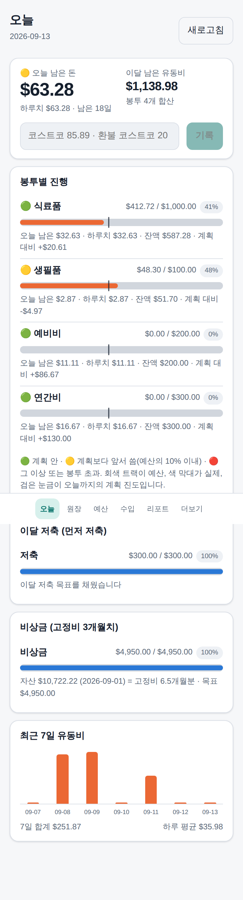
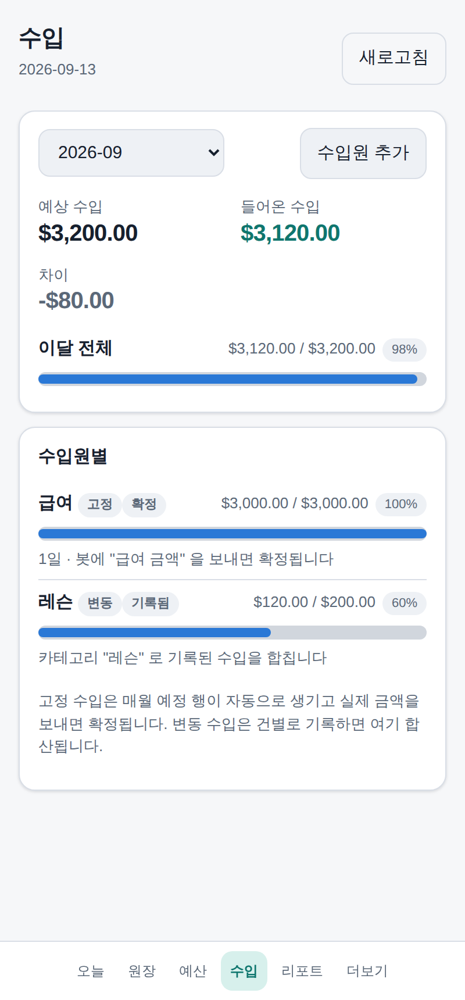
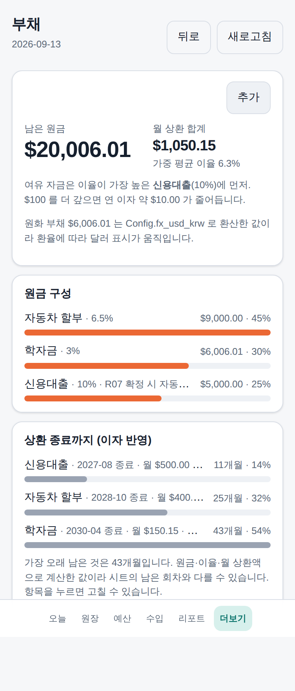
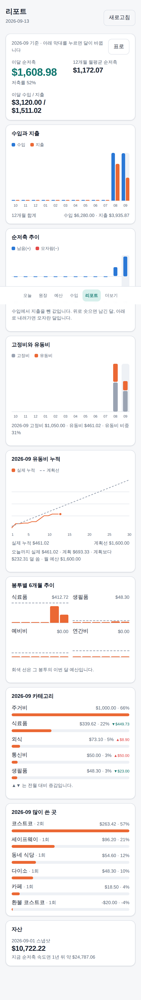

# family-budget

텔레그램에 한 줄 보내면 구글 시트 가계부에 기록되고, 웹앱에서 "오늘 남은 돈"을 본다.

```
"코스트코 85.89"  →  Telegram 봇
                      ↓
                    Apps Script (파싱 · 분류 · 기록)
                      ↓
                    Google Sheet (단일 원장)
                      ↓
                    PWA 웹앱 (GitHub Pages)
```

<p>
  
  
  
</p>
<p>
  
</p>

스크린샷은 가짜 데이터다. 실제 숫자와 이름은 저장소에 두지 않는다.

## 무엇을 하는가

- **최소 입력.** `코스트코 85.89` 한 줄이면 끝이다. `어제`, `9/8`, `5만원`, `$85.89`, `환불 코스트코 20` 을 알아본다.
  `물 2병 5.99` 처럼 숫자가 여럿이어도 확실한 쪽을 고르고, 정말 애매하면 버튼으로 묻는다.
- **사전 학습.** 처음 보는 가맹점은 봉투 버튼을 보내고, 고른 값을 사전에 남긴다. 다음부터는 묻지 않는다. 버튼은 만료되지 않는다.
- **오늘 남은 돈.** `(예산 − 오늘 이전 지출) ÷ 남은 일수` 가 하루치, 거기서 오늘 쓴 만큼 뺀 것이 "오늘 남은 돈". 쓰면 바로 줄어든다.
- **신호등.** 회신 첫 글자가 🟢🟡🔴 다. 빨강이면 "예비비에서 $N 옮기기" 버튼이 붙는다. `이동 예비비→식료품 50` 으로도 옮긴다.
- **고정 항목 자동 기장.** 매월 렌트·관리비·구독료·저축·급여가 예정 상태로 잡히고, 실제 금액을 보내면 확정된다. 같은 항목을 한 달에 두 번 보내면 두 번째 행이 생긴다.
- **취소.** "취소" 는 정확히 마지막 기록을 되돌린다. 확정한 고정비는 예정 상태로 돌아간다.
- **먼저 저축 · 연간비 · 비상금 · 부채 상각.** 저축은 고정 항목처럼 예정→확정, 연간비는 매달 모이는 봉투, 비상금은 고정비 N개월치가 자동 목표, 부채는 상환을 확정할 때 원금이 줄어든다.
- **아침 요약·주간 결산·월 마감.** 아침 요약은 전부 초록이면 한 줄만 온다. 일요일에 주간 결산, 말일에 점수 세 개(저축률·예산 안 봉투·고정비 편차)가 온다.
- **웹앱.** 오늘·원장·예산·수입·리포트와 고정비·부채·자산·목표. 시트를 직접 읽고 쓴다. 서버가 없다.

## 구성

| 계층 | 무엇 | 하지 않는 것 |
|---|---|---|
| Telegram 봇 | 입력 창구. 유동비 잔액과 저축 진행까지만 회신 | 데이터를 갖지 않는다. 고정비 상세·부채·자산은 회신하지 않는다 |
| Apps Script | 유일한 서버. 웹훅, 파싱, 분류, 기록, 시간 트리거 | 금액·날짜 추출에 LLM 을 쓰지 않는다 |
| Google Sheet | 단일 원장과 참조 테이블 | 월별 탭을 만들지 않는다 |
| PWA 웹앱 | 읽기·편집 프런트엔드 | 자체 DB·세션이 없다 |

자세한 내용은 [docs/ARCHITECTURE.md](docs/ARCHITECTURE.md), 시트 구조는 [docs/SHEET_SCHEMA.md](docs/SHEET_SCHEMA.md).

## 시작하기

설치는 [docs/SETUP.md](docs/SETUP.md) 하나로 끝난다. 순서는 이렇다.

1. **시트 만들기** — `runSetupAll` 한 번으로 11개 탭이 생긴다
2. **웹훅 연결** — 웹 앱 배포 → `setWebhook` → 봇에 `코스트코 1.00` 보내기
3. **트리거 설치** — `installTriggers` 로 아침 요약·주간 결산·월 시작·월 마감
4. **웹앱 배포** — GitHub Pages 를 켜면 `main` 에 올릴 때마다 자동 배포

비밀값(봇 토큰, 스프레드시트 ID, 개인 텔레그램 ID)과 실제 가계 숫자는 **저장소에 절대 넣지 않는다.**
Apps Script 의 Script Properties, gitignore 된 `PersonalSeed.js`, 브라우저의 localStorage 에만 둔다.

### 선택 기능

| 기능 | 켜는 법 | 끄면 |
|---|---|---|
| 기존 가계부 이관 | `MIGRATION_MAP` 채우고 `migrateAllCommit` | 안 쓰면 그만 |
| LLM 분류 보조 | Script Properties 에 `ANTHROPIC_API_KEY` | 버튼이 원래 순서로 나온다 |
| 영수증 사진 | Drive 고급 서비스 켜기 | 사진을 보내지 않으면 그만 |
| 카드 CSV 대조 | `RECONCILE_MAP` 열 이름 맞추기 | 안 쓰면 그만 |

## 개발

```bash
# Apps Script 순수 모듈 (파서 · 분류 · 예산 · 원장 규칙 · 이관 · 대조)
cd apps-script && npm test          # 89개 (순수 모듈 + GAS 스모크)
node --check src/*.js               # GAS 전용 파일은 문법만 확인

# 웹앱
cd webapp && npm install
npm run dev                         # http://localhost:5173
npm test                            # 공유 모듈 브리지 검증
npm run build                       # 타입 검사 + 프로덕션 빌드
```

PR 을 열면 `.github/workflows/ci.yml` 이 위 검사와 비밀값 grep 을 돈다. `main` 에 올리면 웹앱이 배포된다.

계산 코드는 한 벌만 있다. `apps-script/src/{Budget,Parser,Classifier,LedgerRules}.js` 를 빌드 시 ESM 으로 바꿔
웹앱이 그대로 쓴다. 봇과 웹앱이 같은 금액을 내놓는 것은 그래서다.

### 지켜야 할 것

`CLAUDE.md` 에 Golden Rules 가 있다. 특히 이 셋은 코드 리뷰에서 확인한다.

- 비밀값과 실제 거래 데이터·가족 이름을 저장소에 쓰지 않는다
- 금액·날짜·통화는 규칙 기반으로만 뽑는다. LLM 은 봉투 분류 보조에만 쓴다
- 원장은 append-only + soft delete. 행을 물리적으로 지우는 코드를 쓰지 않는다

## 저장소 구조

```
apps-script/
  src/*.js          Apps Script 코드. 순수 모듈은 module.exports 가드 포함
  tests/*.test.js   Node 내장 러너로 순수 모듈 검증
webapp/             Vite + React PWA
docs/
  ARCHITECTURE.md   계층·데이터 흐름·보안 경계·재무 구조
  SHEET_SCHEMA.md   탭과 열 정의
  SETUP.md          설치 절차 (P1 ~ P11)
  STATUS.md         진행 상태
  REVIEW-*.md       리뷰 보고서와 처리 현황
  decisions/        ADR
claude/prompts/     단계별 프롬프트 사본
```

## 진행 상태

P0 부터 P11 까지 끝났다. 단계별 내용은 [docs/STATUS.md](docs/STATUS.md) 참고.
리뷰에서 나온 제안과 처리 결과는 [docs/REVIEW-2026-09-13.md](docs/REVIEW-2026-09-13.md) 에 있다.
